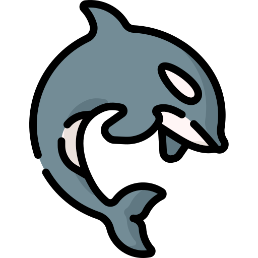
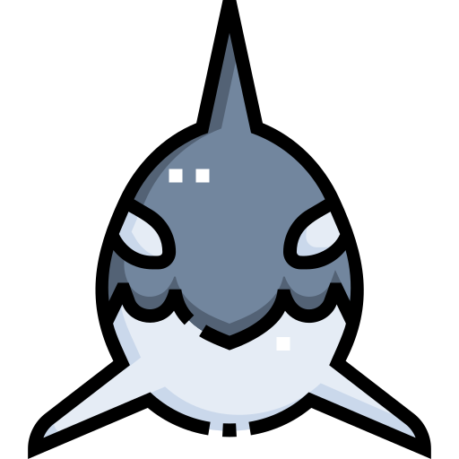

  

## Coding Orca 

`Computer Science & AI`
 

<table style="border:0px">
  <tr>
    <td>
      

I'm a Computer Science student specializing in Artificial Intelligence, and I’m building my knowledge of the digital world one step at a time. I love understanding the core of things, not just the surface; so I often try to build apps from scratch whenever possible.
I'm always looking to expand my skills, and recently I've developed a deep interest in Computer Vision and Computer Graphics.
I might also start posting fun videos on my YouTube channel soon:
 [Orca](https://www.youtube.com/@BizzareOrca) ; so stay tuned!🌊

    </td>
    <td>
      

  

  
  

  </td>
  </tr>
</table>

  

---
## Tech Stack 

---
## Creative Stack🎭

---

## My progress 🟩🟩⬜

#### Tech progress
<table>
<tr>
<th><strong>Tech</strong></th>
<th><strong>Progress</strong></th>
</tr>

<tr>
<td></td>
<td><strong>🟦🟦🟦⬜⬜⬜⬜⬜⬜⬜30% </strong></td>
</tr>

<tr>
<td></td>
<td><strong>🟨🟨🟨🟨🟨🟨🟨⬜⬜⬜70%</strong></td>
</tr>

<tr>
<td></td>
<td><strong>🟧🟧🟧🟧🟧🟧🟧🟧🟧🟧100%</strong></td>
</tr>

<tr>
<td></td>
<td><strong>🟦🟦🟦🟦🟦🟦🟦🟦🟦🟦100%</strong></td>
</tr>

<tr>
<td></td>
<td><strong>⬛⬜⬜⬜⬜⬜⬜⬜⬜⬜10%</strong></td>
</tr>

<tr>
<td></td>
<td><strong>🟦🟦🟦🟦🟦🟦⬜⬜⬜⬜60%</strong></td>
</tr>

<tr>
<td></td>
<td><strong>🟪🟪⬜⬜⬜⬜⬜⬜⬜⬜20%</strong></td>
</tr>

<tr>
<td></td>
<td><strong>🟩🟩🟩🟩🟩⬜⬜⬜⬜⬜50%</strong></td>
</tr>

<tr>
<td></td>
<td><strong>🟦🟦⬜⬜⬜⬜⬜⬜⬜⬜20%</strong></td>
</tr>

<tr>
<td></td>
<td><strong>🟦🟦🟦🟦🟦🟦⬜⬜⬜⬜60%</strong></td>
</tr>

</table>

#### Creative Progress

<table>
<tr>
<th><strong>Tool</strong></th>
<th><strong>Progress</strong></th>
</tr>

<tr>
<td></td>
<td><strong>🟪🟪🟪🟪🟪🟪🟪🟪⬜⬜80%</strong></td>
</tr>

<tr>
<td></td>
<td><strong>🟧⬜⬜⬜⬜⬜⬜⬜⬜⬜10%</strong></td>
</tr>

<tr>
<td></td>
<td><strong>🟦⬜⬜⬜⬜⬜⬜⬜⬜⬜10%</strong></td>
</tr>

<tr>
<td></td>
<td><strong>🟦🟥🟩🟨⬜⬜⬜⬜⬜⬜40%</strong></td>
</tr>

<tr>
<td></td>
<td><strong>🟫⬜⬜⬜⬜⬜⬜⬜⬜⬜10%</strong></td>
</tr>

</table>

Header art by @FOXADHD

<!--
**ProgrammingOrca05/ProgrammingOrca05** is a ✨ _special_ ✨ repository because its `README.md` (this file) appears on your GitHub profile.

Here are some ideas to get you started:

- 🔭 I’m currently working on ...
- 🌱 I’m currently learning ...
- 👯 I’m looking to collaborate on ...
- 🤔 I’m looking for help with ...
- 💬 Ask me about ...
- 📫 How to reach me: ...
- 😄 Pronouns: ...
- ⚡ Fun fact: ...
-->
